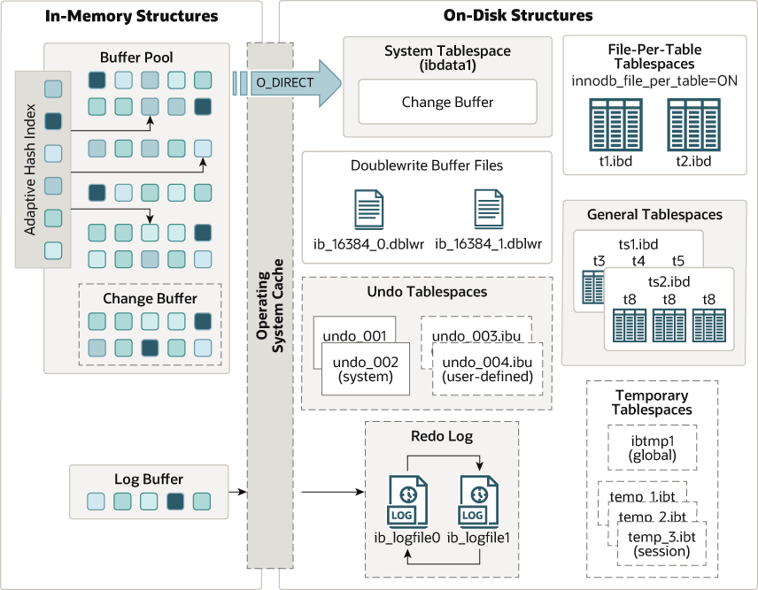

# InnoDB Architecture
InnoDB là storage engine mặc định của MySQL, được thiết kế với trọng tâm là độ tin cậy (reliability) và hiệu năng (performance)

Kiến trúc InnoDB bao gồm 2 loại cấu trúc chính:
- Cấu trúc trong bộ nhớ (In-memory structures)
- Cấu trúc trên đĩa (On-disk structures)

## In-memory structures

Các cấu trúc trong bộ nhớ có nhiệm vụ quản lý và tối ưu hóa việc lưu trữ cũng như truy xuất dữ liệu. Các cấu trúc này bao gồm:
- Buffer pool
- Change buffer
- Adaptive hash index
- Log buffer

### Buffer pool

Buffer pool là nơi lưu trữ tạm (cache) các dữ liệu được truy cập thường xuyên. Nhờ đó, MySQL có thể đọc và ghi dữ liệu trực tiếp trong bộ nhớ, giúp giảm các thao tác I/O tốn kém và cải thiện đáng kể hiệu năng truy vấn

MySQL cho phép bạn cấu hình kích thước của buffer pool bằng cách cấp phát một phần bộ nhớ hệ thống cho việc cache. Nếu bạn sử dụng một server chuyên dụng cho MySQL, bạn có thể cấp phát tối đa khoảng 80% RAM vật lý cho buffer pool để đạt hiệu năng tối ưu.

Để tối ưu hiệu năng của MySQL, bạn có thể điều chỉnh:
- Kích thước buffer pool
- Số lượng buffer pool instances
- Kích thước chunk của buffer pool

### Change buffer
Change buffer chịu trách nhiệm lưu tạm các thay đổi đối với các trang chỉ mục phụ (secondary index pages) khi các trang này chưa có trong buffer pool

Khi bạn thực thi các câu lệnh INSERT, UPDATE hoặc DELETE, dữ liệu của bảng và các trang chỉ mục phụ sẽ bị thay đổi. Nếu các trang liên quan chưa nằm trong buffer pool, change buffer sẽ lưu tạm các thay đổi này để tránh các thao tác I/O tốn thời gian 

### Adaptive Hash Index
Adaptive Hash Index là một cấu trúc trong bộ nhớ giúp tối ưu hiệu năng cho một số thao tác đọc.

Nó được thiết kế để tăng tốc truy cập đến các trang chỉ mục được truy vấn thường xuyên, bằng cách cung cấp cơ chế tra cứu nhanh ngay trong bộ nhớ.

### Log Buffer 
Log buffer là một vùng nhớ dùng để lưu trữ tạm thời các thay đổi trước khi chúng được ghi vào transaction log.

Nó giúp cải thiện hiệu năng bằng cách ghi log vào bộ nhớ trước, sau đó định kỳ ghi (flush) xuống redo log trên đĩa.

Kích thước mặc định của log buffer thường đã đủ cho hầu hết các ứng dụng. Tuy nhiên, nếu hệ thống của bạn có tần suất ghi dữ liệu cao (write-intensive), bạn có thể tăng kích thước log buffer để cải thiện hiệu năng của MySQL.

## On-disk structures
Storage engine InnoDB sử dụng các cấu trúc trên đĩa để lưu trữ dữ liệu một cách lâu dài. Các cấu trúc này đảm bảo tính toàn vẹn dữ liệu, cung cấp khả năng lưu trữ hiệu quả và hỗ trợ các tính năng giao dịch

Cấu trúc trên đĩa bao gồm: 
- System tablespace
- File-per-table tablespaces
- General tablespaces
- Undo tablespaces
- Temporary tablespaces
- Doublewrite buffer
- Redo log
- Undo logs

### System tablespace 
System tablespace đóng vai trò là khu vực lưu trữ cho change buffer.

InnoDB sử dụng một hoặc nhiều file dữ liệu cho system tablespace. Mặc định, MySQL tạo file `ibdata1` trong thư mục dữ liệu.

Tùy chọn khởi động `innodb_data_file_path` xác định kích thước và số lượng file dữ liệu của system tablespace.

### File-per-table tablespaces
File-per-table tablespaces lưu trữ dữ liệu thực tế của các bảng InnoDB.

Khi bạn tạo bảng mới sử dụng InnoDB, mỗi bảng cùng với các index liên quan sẽ được lưu trong một file tablespace riêng với phần mở rộng `.ibd`.

Ví dụ, nếu bạn tạo bảng có tên `tbl_name`, InnoDB sẽ tạo file dữ liệu tương ứng `tbl_name.ibd` trong thư mục dữ liệu.

### General tablespaces
General tablespaces là các tablespace dùng chung có thể lưu trữ nhiều bảng. Chúng được tạo bằng câu lệnh `CREATE TABLESPACE`.

General tablespaces giúp giảm sự trùng lặp metadata của tablespace trong bộ nhớ khi nhiều bảng cùng chia sẻ một tablespace. Vì vậy, chúng có thể mang lại lợi ích về bộ nhớ so với file-per-table tablespaces.

### Undo tablespaces

Undo tablespace lưu trữ undo log, chứa thông tin cần thiết để hoàn tác (undo) các thay đổi gần nhất của một transaction.

MySQL có hai file undo tablespace mặc định là `innodb_undo_001` và `innodb_undo_002`.

### Temporary tablespaces
hi bạn tạo bảng tạm (temporary table), InnoDB sẽ lưu chúng trong temporary tablespaces, cụ thể là session temporary tablespaces.

Nếu bạn thực hiện thay đổi trên các bảng tạm, InnoDB sẽ lưu các rollback segment cho các thay đổi đó trong global temporary tablespace.

### Doublewrite buffer
InnoDB sử dụng Doublewrite Buffer để lưu các page đã được ghi ra từ buffer pool trước khi chúng được ghi thực sự vào các file dữ liệu của InnoDB.

Doublewrite Buffer cho phép InnoDB khôi phục lại bản sao đáng tin cậy của page trong trường hợp xảy ra sự cố lưu trữ.

### Redo log

Redo log là một cấu trúc dữ liệu trên đĩa dùng để lưu trữ các thay đổi với bảng. InnoDB sử dụng redo log trong quá trình khôi phục sau sự cố để sửa lại dữ liệu bị ghi dở bởi các transaction chưa hoàn tất

Ví dụ: Khi bạn thực hiện các câu lệnh SQL làm thay đổi dữ liệu như INSERT, UPDATE, DELETE, redo log sẽ ghi lại các yêu cầu này vào file redo log

Nếu xảy ra sự cố, MySQL ré replay các thay đổi trong redo log chưa hoàn tất trước khi chấp nhận kết nối trở lại 

nnoDB sử dụng một tập các file redo log (`ib_logfile0`, `ib_logfile1`, …) để lưu các thay đổi dữ liệu của bảng.

### Undo logs
Undo logs lưu trữ thông tin cần thiết cho các thao tác rollback.

Ví dụ, nếu bạn thực hiện một transaction và quyết định rollback, InnoDB sẽ sử dụng undo log để đảo ngược các thay đổi đã thực hiện trong transaction đó.

InnoDB sử dụng một tập các file undo log, thường có tên như `undo_001.ibd`, `undo_002.ibd`, … để lưu trữ các log này.